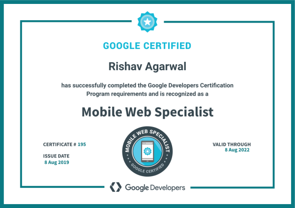
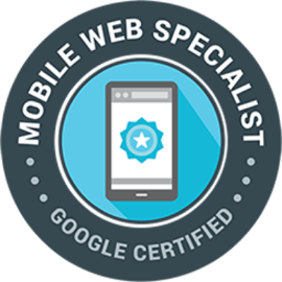
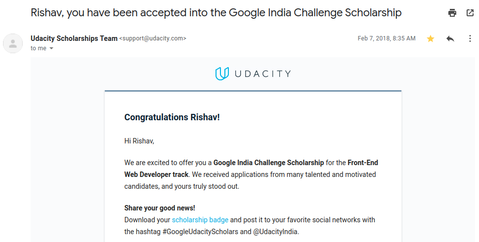
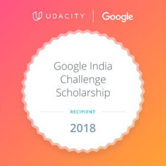
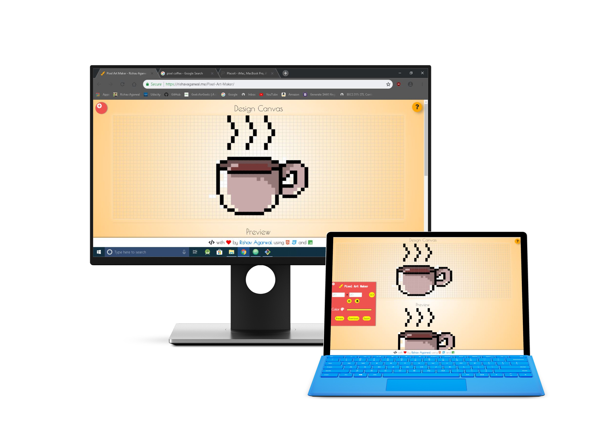
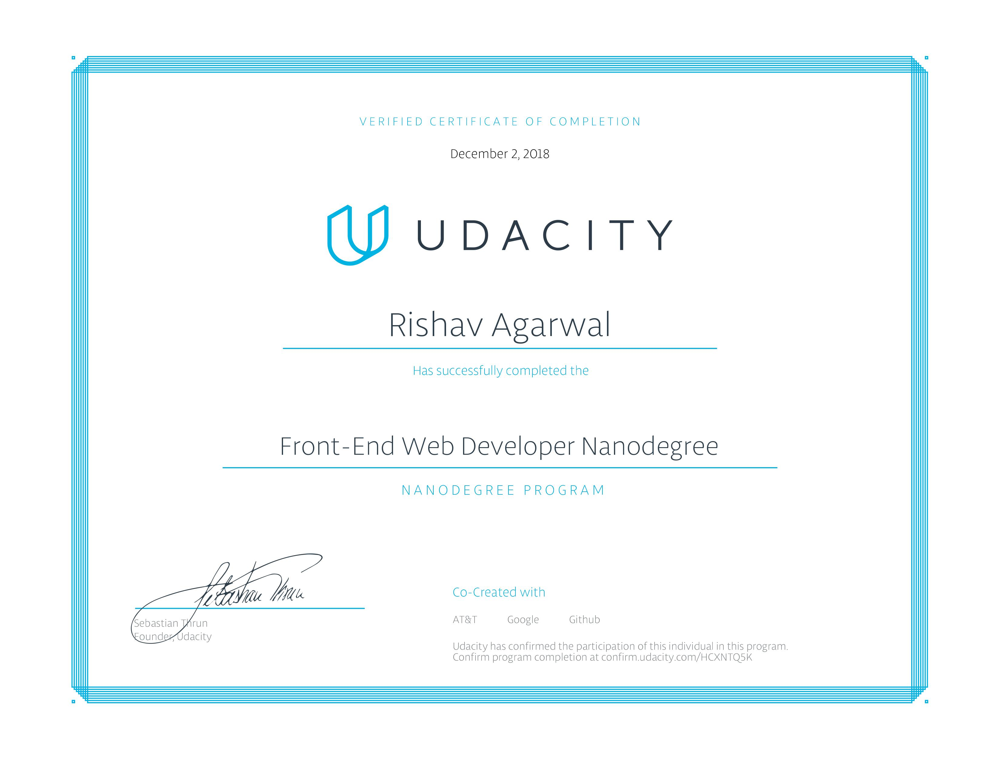
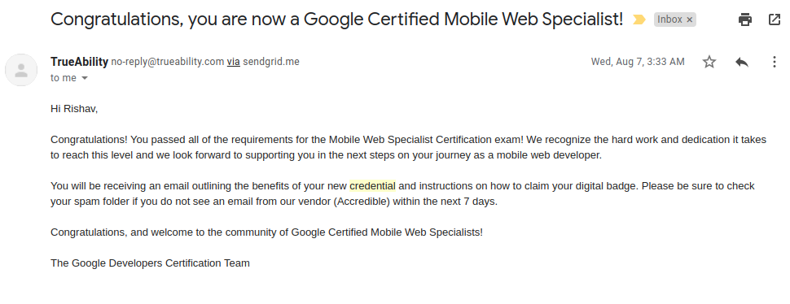
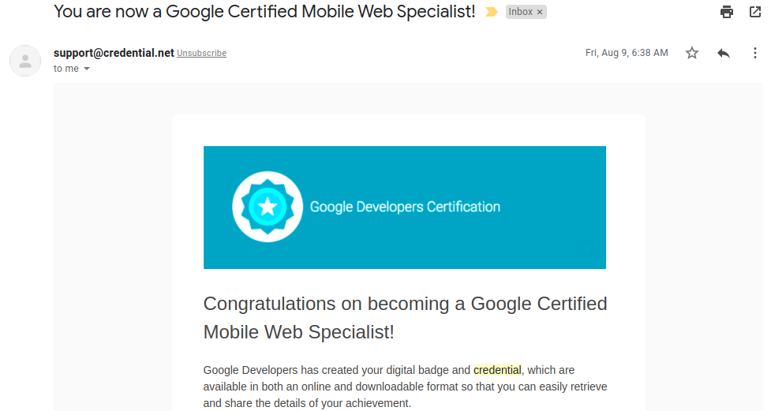
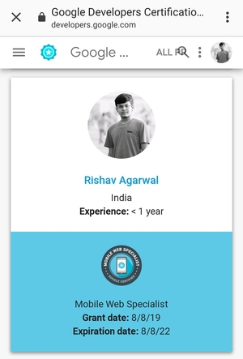

On 8th August, 2019, I became a Google certified mobile web specialist and I was really overjoyed when I was said so after I passed the [Google mobile web specialist exam](https://developers.google.com/training/certification/mobile-web-specialist/) and got my [certificate and the digital badge](https://www.credential.net/vgosmfxl).🤩

---

##The journey begins!
It was probably in December, 2017 when Google India with Udacity announced a scholarship program for front end web developer nanodegree. It was a two-phase program. First was beginner level, then only **300 out of 10000** applicants nation-wide was selected for the second phase. Tbh, I casually applied for the scholarship with no expectation of the selection. But 2 months later, on 7th Feb, 2018 I received this mail from Udacity saying that I have been selected for the phase 1 of the scholarship program!🎉

##Phase 1
So the first phase of the scholarship challenge started on 14th Feb, 2018 (A great day to start the program! Didn't matter to me though😛). This was 3 month phase in which we were given a beginner course on html, css and js. A slack channel, a discourse forum were made. And we were told that only top 300 performers in the first phase will be awarded the actual nanodegree (6-month front end course) by Udacity.

The first day of the course, almost 10k students in the forums! Out of which 300 were to receive the scholarship!😱

The criteria for receiving the scholarship was pretty neat though. We had the access to the course along with few mini projects for self-evaluation and projects to be evaluated by the mentors from Udacity. Now, we were needed to not just get the projects evaluated by the mentors but also be active in the forums and help our fellow scholarship recipients. This was pretty exciting and a great experience interacting with the students from different parts of India.🤩

These were some tasks we had to do during the first phase-

1. https://codepen.io/rish_av_/full/RQYgpw
2. https://codepen.io/rish_av_/full/JpwxMG
3. https://codepen.io/rish_av_/full/mXvGQy
4. Portfolio- https://rishav-agarwal.github.io/

####The final project-
_The amazing pixel art maker_- https://rishav-agarwal.github.io/Pixel-Art-Maker/

With the final project the phase 1 ended which lasted till mid May, 2018. The results for the phase 2 were to be anounced by May end. These 2 weeks were really tough to exhaust. But the hard work did bring good results. I was selected as one of the **300 out of 10000 applicants nation-wide recipients of the Google-Udacity scholarship**!🎉🥳

##Phase 2
This was the actual 6-month nanodegree course (worth Rs. 50000+) which Google and Udacity had to offer. Believe me, this is definitely one of the best front-end courses that has been ever made. The teachers and mentors at Google and Udacity are amazing! The course content, the teaching skills, the projects etc all were perfect! Special thanks to [Akshit Jain](https://twitter.com/akshtjn) for being such an amazing mentor. From conducting AMA sessions to clearing course related/technical doubts, he did everything he could for us! ❤️

The nanodegree started on 26th May, 2018. It included html, css and js basics from previous phase but also advanced concepts including but not limited to-

- OOP in js, ES6
- Using git and github
- Optimising front-end code
- Accessibility, Web tooling and automation unit testing
- Awesome concepts like MVC architecture, js promises, ajax
- Making single page apps- caching, service workers, offline first web apps
- The best part- ReactJS!

These were the projects that I made during the course-

- Pixel art maker- https://rishav-agarwal.github.io/Pixel-Art-Maker/
- Memory game- https://rishav-agarwal.github.io/Memory-Game/
- Arcade game- https://rishav-agarwal.github.io/Arcade-Game/
- Restaurant review offline first app- https://github.com/Rishav-Agarwal/Restaurant-Review
- MyReads (Book traking app)- https://github.com/Rishav-Agarwal/MyReads

####The final project
_Neighbourhood map_- https://github.com/Rishav-Agarwal/neighborhood-map. 
This project tested all the topics taught and the implementations skills.

##Course completion

After successfully completing the course during the month of December, 2018 and getting all the projects reviewed by the mentors. I finally got the [certification of completion of the course](https://graduation.udacity.com/confirm/HCXNTQ5K)!😍

##The Google certification😎
Towards the end of July, 2019, some of the scholarship recipients got an oppurtunity to take the Google's mobile web specialist certification exam (worth \$150) for free! We had to schedule the exam on or before 31st July, 2019 and I had just a week to refresh the concepts that I learnt 6 months ago!😟

###Little about the exam
This is what Google has to say-

> The Mobile Web Developer Certification is a performance-based exam that challenges mobile web developers to write code in response to real-world tasks. Based on extensive job task analyses, candidates earning this certification have shown that they have the skills expected of an advanced-level mobile web developer, and are capable of writing performant and responsive applications for the mobile web.

####Content and preparation
The exam mainly tested these topics-

- Basic Website Layout and Styling
- Front End Networking
- Accessibility
- Progressive Web Apps
- Performance Optimization and Caching
- Testing and Debugging
- ES2015 Concepts and Syntax
- Mobile Web Forms

The exam was condcuted in a Linux based environment provided by Google. Access to Google chrome and Atom IDE was provided. I was given 18-20 coding problems and I had to solve them in 4 hours followed by an exit interview to prove that I was the actual person who took the exam.

To prepare for the exam I would suggest going through the official [study guide](https://developers.google.com/training/certification/mobile-web-specialist/study-guide/) given by Google. But, this doesn't guarantee that you will clear the exam. It usually requires experience in front end web development.

####Result
So, I scheduled the exam on 31st July, 2019. One week later on 7th August, 2019, I received this mail saying that I successfully cleared the exam!🎉

Became Google certified mws on 8th of August and on 9th, got the [credentials](https://www.credential.net/vgosmfxl)!

Later that month, it was on the official website of Google developers🤩😊

---

The Google-Udacity scholarship has continuously been a lot helpful for me, even today! This would not have been possible without Google India, Udacity, the teachers, mentors and the fellow scholars. Kudos to everyone! Once again, special thanks to [Akshit Jain](https://twitter.com/akshtjn) for being such a great person and an amazing person!💖 Peace.

Check out all of my projects at github: https://github.com/Rishav-Agarwal 
LinkedIn: https://www.linkedin.com/in/mr-redible 
Twitter: https://twitter.com/MrRedible 
