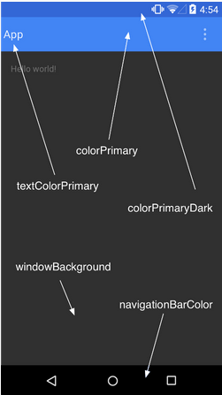
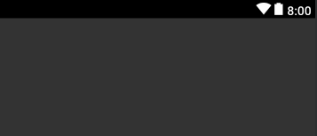
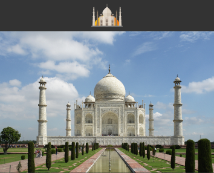
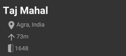

We shall try to build an android page for a famous monument- Taj Mahal to learn about views and view groups. Hope you know the basics of [designing android apps](/android-designing-basics).

---

###Already excited?🤩

Lets look at what we are going to build-

Pretty cool, right?

##First things first

Undo any changes you have done to your new app or [create a new app](/android-start-building-apps) and remove the `TextView` displaying `Hello world`. Then, switch to dark theme. Yay!🌃

####Making things dark

In the _Project_ window, select _Android_ view (refer to [this post](/android-start-building-apps)) and locate the file `colors.xml` (`app > res > values > colors.xml`) and update the file as such-

```xml{3-5}
<?xml version="1.0" encoding="utf-8"?>
<resources>
	<color name="colorPrimary">@android:color/black</color>
	<color name="colorPrimaryDark">@android:color/black</color>
	<color name="colorAccent">@android:color/darker_gray</color>
</resources>
```

**So, what exactly happened?** We just defined some colors which will be used in our app. So, `colorPrimary` would return `@android:color/black` that you can guess is black and so on.<br/>
So, `colors.xml` is used to pre define some colors that can be used in our app.

Now, locate the `styles.xml` in the same directory and update as such-

```xml{3, 5-7}
<resources>
	<!-- Base application theme. -->
	<style name="AppTheme" parent="Theme.AppCompat.Light.NoActionBar">
		<!-- Customize your theme here. -->
		<item name="colorPrimary">@color/colorPrimary</item>
		<item name="colorPrimaryDark">@color/colorPrimaryDark</item>
		<item name="colorAccent">@color/colorAccent</item>
	</style>
</resources>
```

This is were we are informing android about the theme and styles used in our app. Here, we are specifying that our app should not have action bar/ toolbar and the various types of color for app theme. The following picture will help you to understand what different style item means to android.

So for our app, we set the status bar and action bar's color to black and accent color (such as for checkboxs, radio buttons etc.) to be grey. These colors are fetched from the `colors.xml` file!

##Time to add some images and text
Locate `activity_main.xml` (`app > res > layout > activity_main.xml`) and you will find it starting with a tag named `ConstraintLayout`.

#####Constraint Layout
`ConstraintLayout` is a view group which allows us to create large, complex and flexible layouts without much nesting (of view groups). We use constraints to specify how views are relatively positioned with their parent or each other. We will use it to build our layout and see how awesome this is! Constraint layout can be used by just drag-and-drop feature but we will stick to writing xml code for now.<br>
You can check [this codelab by Google on ConstraintLayout](https://codelabs.developers.google.com/codelabs/constraint-layout) for a complete overview.

Now, we change the background color of our layout-

```xml{6}
<androidx.constraintlayout.widget.ConstraintLayout
  xmlns:android="http://schemas.android.com/apk/res/android"
  xmlns:tools="http://schemas.android.com/tools"
  android:layout_width="match_parent"
  android:layout_height="match_parent"
  android:background="#333"
  tools:context=".MainActivity">

</androidx.constraintlayout.widget.ConstraintLayout>
```

Changing the backgroud color to `#333` gives us this result-

Dark!❤

###Image time!⏰
There goes our first image-

```xml
<ImageView
  android:id="@+id/iv_tm_top"
  android:layout_width="match_parent"
  android:layout_height="60dp"
  android:contentDescription="Taj Mahal"
  android:src="@drawable/tajmahal"
  app:layout_constraintTop_toTopOf="parent" />
```

Lets understand on line at a time-

- `ImageView` is the view responsible for displaying images in our app.
- `id` attribute identifies the view uniquely in the layout and then the view can be later refered using it. The general syntax for creating an id is- `@+id/id_name`
- `layout_width` and `layout_height` specifies the how much space should the view occupy horizontally and vertically respectively. Width is set to `match_parent` meaning take up all the remaining horizontal space available to the view. Height is set to `60dp` meaning occupy 60 [density independent pixels](https://stackoverflow.com/a/2025541/7076907) vertically.
- `contentDescription`, as the name suggests, is used to provide a short description for image.
- `src` is used to specify the path of the image asset to display. All the image assets are kept inside `drawable` folder (`app > res > drawable`). Go ahead and download one for you. In this case, I have an image named tajmahal. A general syntax would be- `@drawable/image_file_name` (_Note_: **no** extension)
- `layout_constraintTop_toTopOf`: This specifies a constraint for the image such that the top of the image is to the top of `parent` (in this case) or may be any other view. So, it sticks to the top of the screen. Pretty intuitive, right?

Lets add the bigger image really fast.

```xml
<ImageView
  android:id="@+id/iv_tm_main"
  android:layout_width="match_parent"
  android:layout_height="wrap_content"
  android:adjustViewBounds="true"
  android:contentDescription="Taj Mahal"
  android:src="@drawable/tajmahalbig"
  app:layout_constraintTop_toBottomOf="@id/iv_tm_top" />
```

- Notice `wrap_content` for height. It says take up only that space which I actually need. So if an image's height is 40px, it will take just 40px.
- `adjustViewBounds` is a simple way to preserve image's aspect ratio. Try experimenting with it!
- `layout_constraintTop_toBottomOf` specifies that the top of the image should be at the bottom of our smaller image. Notice how the above image is referenced. _Note_: **No** `+` symbol. This is actually intuitive, `+` while creating the id and nothing while referencing!

This is the current output-

It took architectural geniuses 17 years to complete the Taj Mahal but just 17mins for you!😜

###Lots of images!😫 Lets add some text so that it makes sense
Every app contains some text, doesn't it?<br/>
Let our first text roll in🥁

```xml
<TextView
  android:id="@+id/tv_tajmahal"
  android:layout_width="wrap_content"
  android:layout_height="wrap_content"
  android:layout_margin="8dp"
  android:text="Taj Mahal"
  android:textColor="@android:color/white"
  android:textSize="24sp"
  android:textStyle="bold"
  app:layout_constraintStart_toStartOf="parent"
  app:layout_constraintTop_toBottomOf="@id/iv_tm_main" />
```

I hope this is clean and intuitive. The `margin` attribute pushes the view `<value>` distance away from all the sides and the extra space is not the part of the view. The result should be something like this-


####Adding the details
We will use the `LinearLayout` to add some details about our monument. Lets see how does is look-

```xml
<LinearLayout
  android:id="@+id/ll_info"
  android:layout_width="match_parent"
  android:layout_height="wrap_content"
  android:layout_margin="8dp"
  android:orientation="vertical"
  android:paddingStart="8dp"
  android:paddingEnd="8dp"
  app:layout_constraintStart_toStartOf="parent"
  app:layout_constraintTop_toBottomOf="@id/tv_tajmahal">

  <TextView
    android:layout_width="wrap_content"
    android:layout_height="wrap_content"
    android:drawableStart="@drawable/location"
    android:text="Agra, India"
    android:textColor="@android:color/darker_gray"
    android:textSize="14sp" />

  <TextView
    android:layout_width="wrap_content"
    android:layout_height="wrap_content"
    android:layout_marginTop="4dp"
    android:drawableStart="@drawable/height"
    android:text="73m"
    android:textColor="@android:color/darker_gray"
    android:textSize="14sp" />

  <TextView
    android:layout_width="wrap_content"
    android:layout_height="wrap_content"
    android:layout_marginTop="4dp"
    android:drawableStart="@drawable/opengate"
    android:text="1648"
    android:textColor="@android:color/darker_gray"
    android:textSize="14sp" />
</LinearLayout>
```

**DO NOT PANIC!** Its really simple.

The linear layout allows us to align the views in a single direction (`vertical` or `horizontal` specified by `orientation` attribute). So all the `TextView`s in the above `LinearLayout` are stacked vertically. Check [this page from android developers website](https://developer.android.com/guide/topics/ui/layout/linear) for an overview of LinearLayout. Though we always use contraint layout for various reasons including performance, we used linear layout here for the sake of demonstration.

- `padding` is very similar to `margin`. One of the main difference is that the view owns the padded space while margin is outside the view. Please refer to [this StackOverflow answer](https://stackoverflow.com/a/21959155/7076907) for a better understanding of their difference.
- `drawableStart` attribute in the text view is used to add an image before the actual text. This image is part of the `TextView`.

This is how it looks like-


####Wrapping up
Finally add a paragraph about Taj Mahal-

```xml
<TextView
  android:layout_width="wrap_content"
  android:layout_height="wrap_content"
  android:layout_margin="8dp"
  android:layout_marginTop="4dp"
  android:text="The Taj Mahal was commissioned by Shah Jahan in 1631, to be built in the memory of his wife Mumtaz Mahal, a Persian princess who died on 17 June that year, giving birth to their 14th child, Gauhara Begum."
  android:textColor="#ccc"
  android:textSize="16sp"
  app:layout_constraintStart_toStartOf="parent"
  app:layout_constraintTop_toBottomOf="@id/ll_info" />
```

##Final code
This is the final code for `activity_main.xml`-

```xml
<?xml version="1.0" encoding="utf-8"?>
<androidx.constraintlayout.widget.ConstraintLayout
  xmlns:android="http://schemas.android.com/apk/res/android"
  xmlns:app="http://schemas.android.com/apk/res-auto"
	xmlns:tools="http://schemas.android.com/tools"
	android:layout_width="match_parent"
	android:layout_height="match_parent"
	android:background="#333"
	tools:context=".MainActivity">

	<ImageView
		android:id="@+id/iv_tm_top"
		android:layout_width="match_parent"
		android:layout_height="60dp"
		android:contentDescription="Taj Mahal"
		android:src="@drawable/tajmahal"
		app:layout_constraintTop_toTopOf="parent" />

	<ImageView
		android:id="@+id/iv_tm_main"
		android:layout_width="match_parent"
		android:layout_height="wrap_content"
		android:adjustViewBounds="true"
		android:contentDescription="Taj Mahal"
		android:src="@drawable/tajmahalbig"
		app:layout_constraintTop_toBottomOf="@id/iv_tm_top" />

	<TextView
		android:id="@+id/tv_tajmahal"
		android:layout_width="wrap_content"
		android:layout_height="wrap_content"
		android:layout_margin="8dp"
		android:text="Taj Mahal"
		android:textColor="@android:color/white"
		android:textSize="24sp"
		android:textStyle="bold"
		app:layout_constraintStart_toStartOf="parent"
		app:layout_constraintTop_toBottomOf="@id/iv_tm_main" />

	<LinearLayout
		android:id="@+id/ll_info"
		android:layout_width="match_parent"
		android:layout_height="wrap_content"
		android:layout_margin="8dp"
		android:orientation="vertical"
		android:paddingStart="8dp"
		android:paddingEnd="8dp"
		app:layout_constraintStart_toStartOf="parent"
		app:layout_constraintTop_toBottomOf="@id/tv_tajmahal">

		<TextView
			android:layout_width="wrap_content"
			android:layout_height="wrap_content"
			android:drawableStart="@drawable/location"
			android:text="Agra, India"
			android:textColor="@android:color/darker_gray"
			android:textSize="14sp" />

		<TextView
			android:layout_width="wrap_content"
			android:layout_height="wrap_content"
			android:layout_marginTop="4dp"
			android:drawableStart="@drawable/height"
			android:text="73m"
			android:textColor="@android:color/darker_gray"
			android:textSize="14sp" />

		<TextView
			android:layout_width="wrap_content"
			android:layout_height="wrap_content"
			android:layout_marginTop="4dp"
			android:drawableStart="@drawable/opengate"
			android:text="1648"
			android:textColor="@android:color/darker_gray"
			android:textSize="14sp" />
	</LinearLayout>

	<TextView
		android:layout_width="wrap_content"
		android:layout_height="wrap_content"
		android:layout_margin="8dp"
		android:layout_marginTop="4dp"
		android:text="The Taj Mahal was commissioned by Shah Jahan in 1631, to be built in the memory of his wife Mumtaz Mahal, a Persian princess who died on 17 June that year, giving birth to their 14th child, Gauhara Begum."
		android:textColor="#ccc"
		android:textSize="16sp"
		app:layout_constraintStart_toStartOf="parent"
		app:layout_constraintTop_toBottomOf="@id/ll_info" />

</androidx.constraintlayout.widget.ConstraintLayout>
```

And this is the result-

Beautiful! Isn't it?✨

---

Wohoo! You have reached the end.🎉🎊<br/>
Go ahead and make your own page, may be about yourself, your pet or a restaurant. And don't forget to share your work in the comments below.

<div style="width: 100%; display: flex; justify-content: space-between;">
  <span>Prev: <a href="/android-designing-basics">Designing basics</a></span>
</div>
